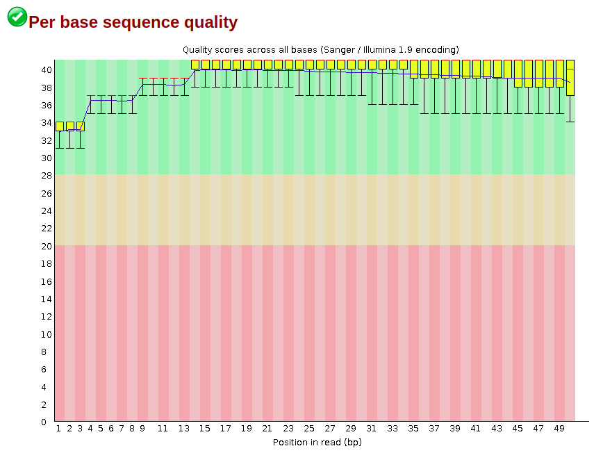
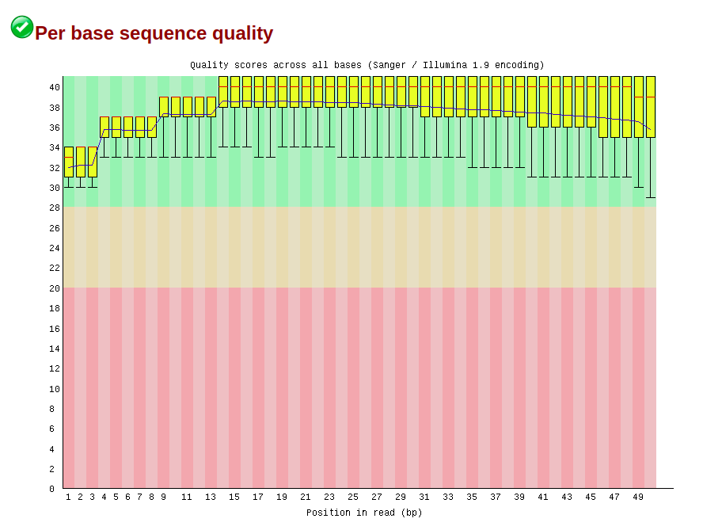
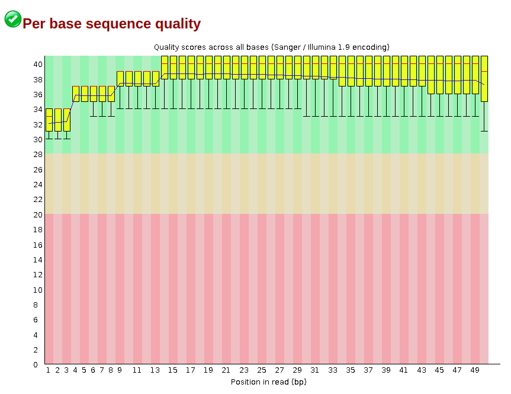
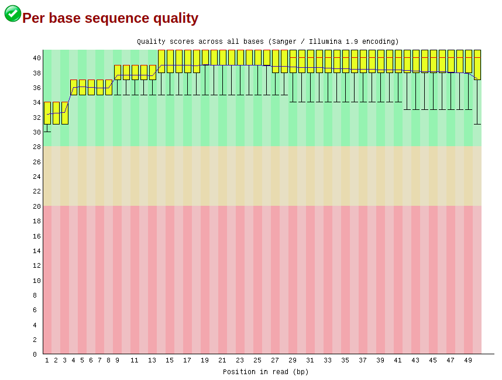
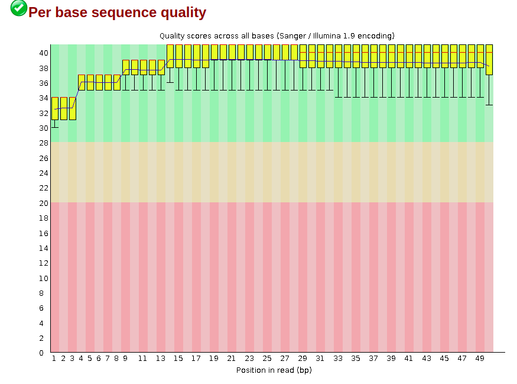
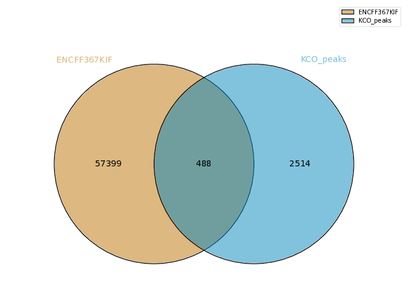

Если сравнить качества ридов у подрезанных и неподрезанных вариантов, видно, что можно работать и с неподрезанными, что я и сделал далее.
Полные fastqc html файлы можно найти в папке data. Вот скриншоты из них:

*ENCFF391TRF*

*ENCFF391TRF_trimmed*

*ENCFF822KCO*

*ENCFF822KCO_trimmed*

*ENCFF259JCU*

*ENCFF259JCU_trimmed*

**Статистика выравнивания**

| ID | Ридов | Не выровнившихся | Уникально выровнившихся | Выровнившихся больше одного раза |
|-|-|-|-|-|
| ENCFF391TRF | 38513348 | 86.83% | 3.81% | 9.36% |
| ENCFF822KCO | 88755850 | 82.53% | 4.34% | 13.13% |
| ENCFF259JCU | 17634249 | 86.60% | 3.85% | 9.55% |

**Полученные диаграммы:**

